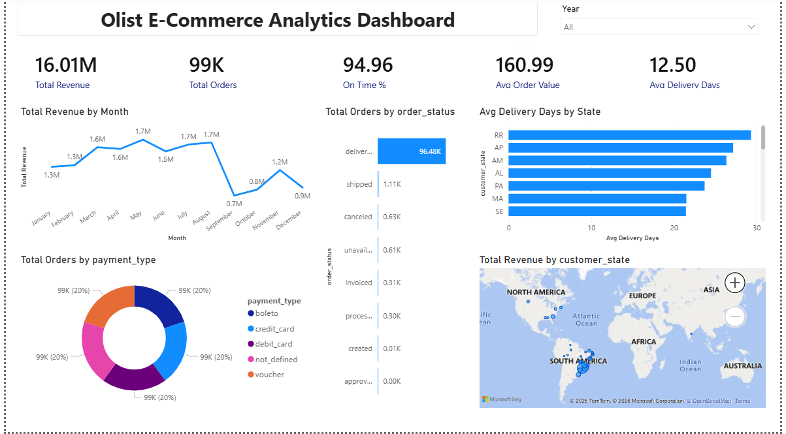

# 🛒 Olist E-Commerce Analytics

End-to-end data analysis project on the **Brazilian Olist E-Commerce dataset** (Kaggle).  
Covers data cleaning, SQL analysis, KPI tracking, customer segmentation, and an interactive Power BI dashboard.

---

## 📊 Dashboard Preview



---

## 🎯 Business Questions Answered

- What is the overall revenue, order volume, and customer base?
- Which product categories and sellers drive the most revenue?
- How is delivery performance — on-time rate and average delay?
- What payment methods do customers prefer?
- Which states and cities generate the most orders?
- Who are the high-value customers (RFM segmentation)?

---

## 🛠️ Tools & Technologies

| Tool | Purpose |
|------|---------|
| MySQL | Data storage, cleaning, and analysis |
| Power BI | Interactive dashboard and visualization |
| Kaggle | Dataset source |

---

## 📁 Project Structure

```
Olist-Ecommerce-Analytics/
├── olist_analysis.sql     # Complete SQL analysis (19 sections)
├── dashboard.png          # Power BI dashboard screenshot
└── README.md
```

---

## 📦 Dataset

- **Source:** [Kaggle — Brazilian E-Commerce Public Dataset by Olist](https://www.kaggle.com/datasets/olistbr/brazilian-ecommerce)
- **Period:** 2016 – 2018
- **Size:** 100K+ orders, 9 tables

| Table | Records |
|-------|---------|
| Customers | 99,441 |
| Orders | 99,441 |
| Order Items | 112,650 |
| Payments | 103,886 |
| Products | 32,951 |
| Sellers | 3,095 |
| Reviews | 99,224 |

---

## 🗄️ SQL Analysis — 19 Sections

| Section | Analysis |
|---------|---------|
| 1–3 | Database setup, table creation, data import |
| 4 | Data profiling — row counts, nulls, duplicates |
| 5 | Business KPIs — revenue, AOV, avg items |
| 6 | Time-series — monthly revenue & order trends |
| 7 | Geographic analysis — top states & cities |
| 8 | Product & category analysis |
| 9 | Seller performance analysis |
| 10 | Delivery performance — on-time rate, delays |
| 11 | Payment analysis — methods & installments |
| 12 | Customer behaviour — repeat rate |
| 13 | Basket analysis |
| 14 | RFM table — Recency, Frequency, Monetary |
| 15 | Customer segmentation — High/Medium/Low value |
| 16 | Customer Lifetime Value (CLV) |
| 17 | Window functions — RANK, DENSE_RANK, NTILE |
| 18 | Views & Stored Procedures |
| 19 | Cohort retention analysis |

---

## 📈 Key Insights

- 💰 **Total Revenue:** R$16.0M across all orders
- 📦 **Total Orders:** 99,441 with 97% successfully delivered
- 👤 **Repeat Purchase Rate:** Only 3.1% — most customers buy once
- 🚚 **On-Time Delivery:** 92.1% of delivered orders arrived on time
- 💳 **Payment:** 74% customers pay via Credit Card
- 🏙️ **Top State:** São Paulo contributes 38% of total revenue
- 🛍️ **Top Category:** Health & Beauty leads in revenue

---

## ⚙️ How to Run

**MySQL Setup:**
```sql
-- 1. Create database
CREATE DATABASE olist_ecommerce;
USE olist_ecommerce;

-- 2. Run olist_analysis.sql
-- 3. Update file paths in LOAD DATA statements to your local paths
```

**Power BI Setup:**
1. Install MySQL Connector from mysql.com
2. Open Power BI Desktop
3. Get Data → MySQL Database → localhost → olist_ecommerce
4. Load: customers, orders, order_items, payments, products, sellers, category_translation
5. Set relationships as defined in SQL foreign keys
6. Create DAX measures for KPIs

---

## 👨‍💻 Author

**Chetan**  
Aspiring Data Analyst  
📧 chetanupadhayay24@gmail.com  
🔗 https://www.linkedin.com/in/chetan-upadhayay

---

*Dataset courtesy of Olist & André Sionek on Kaggle*
